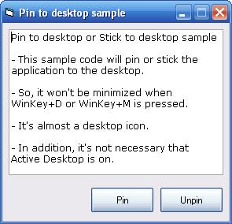



## Pin or Stick an application to Desktop \(and unpin\)

### Description

Module to easily pin (or stick) and unpin an application to and from Windows' desktop. It will work with "Active Desktop" on or off and with "Show desktop icons" on or off too. The WinKey+D or WinKey+M won't minimize the pinned application. Tested only in Windows XP. Last update: added unpin sub.
 
### More Info
 

             |
---                |---
**Submitted On**   |2005-06-29 13:20:02
**By**             |[Carlos\-Sz](https://github.com/Planet-Source-Code/PSCIndex/blob/master/ByAuthor/carlos-sz.md)
**Level**          |Beginner
**User Rating**    |5.0 (10 globes from 2 users)
**Compatibility**  |VB 6\.0
**Category**       |[Miscellaneous](https://github.com/Planet-Source-Code/PSCIndex/blob/master/ByCategory/miscellaneous__1-1.md)
**World**          |[Visual Basic](https://github.com/Planet-Source-Code/PSCIndex/blob/master/ByWorld/visual-basic.md)
**Archive File**   |[Pin\_or\_Sti1906966292005\.zip](https://github.com/Planet-Source-Code/carlos-sz-pin-or-stick-an-application-to-desktop-and-unpin__1-61395/archive/master.zip)

